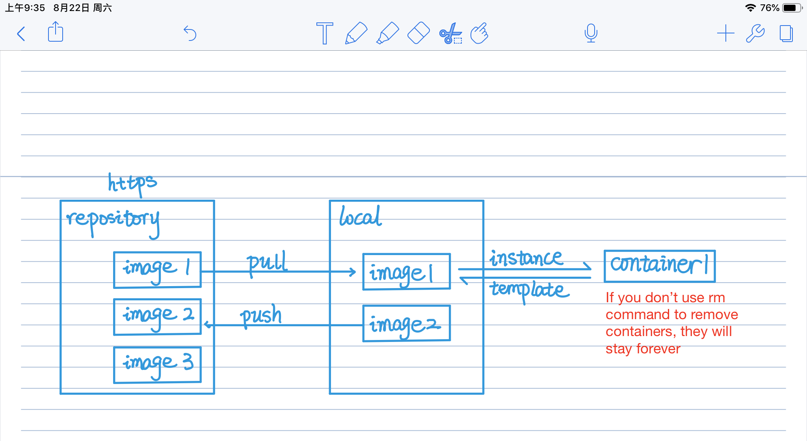

## PART I:Clean up Docker

### 1 Basic Concept



You can consider every container as a independent host, and regard each image as the virtual machine image. A virtual machine can create two or more independent virtual hosts.

### 2 Remove Old Containers

You can use the option “-q” to print only the numeric ID and once it is listed, we can use the output to an input of the remove command to remove all containers listed.

#### List Containers

```
docker ps
docker ps -a
```
–all , -a Show all containers (default shows just running)

#### Remove containers

```
docker rm ID_or_Name
docker rm ID_or_Name1 ID_or_Name2
```

#### Stop and remove all containers
```
docker stop $(docker ps -a -q)
docker rm $(docker ps -a -q)
```

### 3 Remove Old Images

#### List docker image

```
docker images
docker images -a
```
–all , -a Show all images (default hides intermediate images)

#### Remove docker image

```
docker rmi image_id
docker rmi image_id1 image_id2
```

#### Remove all docker images

```
docker rmi -f $(docker images -q)
```

#### Remove dangling images

```
docker rmi $(docker images -f "dangling=true" -q)
```
The prune command is also available
```
docker image prune
```

### 4 Remove Old Volumes

#### List the docker volumes

```
docker volume ls
docker volume ls -f dangling=true # List dangling volumes
```

#### Remove docker volumes

```
docker volume rm volume_name volume_name
docker volume rm $(docker volume ls -f dangling=true -q)
docker volume rm $(docker volume -a -q)
```

### 4 Remove docker ce
```
sudo apt-get remove docker-ce
```

---

## PART II:Install Docker Community Edition

### 1 Install

Docker Community Edition (CE) is the classic open source Docker environment.

```
sudo apt-get update

# necessary packages before installing docker
sudo apt-get install apt-transport-https ca-certificates curl software-properties-common 

# Add Docker’s official SSH key to apt
curl -fsSL https://mirrors.aliyun.com/docker-ce/linux/ubuntu/gpg | sudo apt-key add - 

# Verify the fingerprint of the key, by looking at the last 8 characters
sudo apt-key fingerprint 0EBFCD88

# Add the repository for the stable version of Docker
sudo add-apt-repository "deb [arch=amd64] https://mirrors.aliyun.com/docker-ce/linux/ubuntu $(lsb_release -cs) stable"

sudo apt-get update

sudo apt-get install docker-ce

# Verify the Docker
sudo docker run hello-world
```

### The accelerator configuration

If you have accelerators, you can pull or push repositories faster.

```
vim /etc/docker/daemon.json
```

The following is content of the json file.

```
{
  "registry-mirrors" : [
    "http://ovfftd6p.mirror.aliyuncs.com",
    "http://registry.docker-cn.com",
    "http://docker.mirrors.ustc.edu.cn",
    "http://hub-mirror.c.163.com"
  ],
  "insecure-registries" : [
    "registry.docker-cn.com",
    "docker.mirrors.ustc.edu.cn"
  ],
  "debug" : true,
  "experimental" : true
}

```

### Open docker

```
# open docker
sudo systemctl enable docker

# observe the status of docker 
sudo systemctl status docker
```

---

## PART III:Run shinyApp successfully in local

### 1 Create a new directory to develop your environment

```
mkdir shiny
cd shiny
```

### 2 Set up a Dockerfile

```
# basic image: https://hub.docker.com/r/rocker/shiny
FROM rocker/shiny

# magic spells that speed up 
RUN  sed -i s@/archive.ubuntu.com/@/mirrors.aliyun.com/@g /etc/apt/sources.list
RUN  apt-get clean

# install some basic commands
RUN apt-get update && apt-get install -y \
    sudo \
    pandoc \
    pandoc-citeproc \
    libcurl4-gnutls-dev \
    libcairo2-dev \
    libxt-dev \
    libssl-dev \
    libssh2-1-dev

# install libraries you need 
RUN R -e "install.packages(c('shiny','rmarkdown'), repos='https://mirrors.tuna.tsinghua.edu.cn/CRAN/')"


# copy the RScript files to the image
RUN mkdir /root/euler
COPY euler /root/euler

# set the port of container(it maybe useless) 
EXPOSE 3838

# run your shinyapp
CMD ["R", "-e", "shiny::runApp('/root/euler/shinyapp.R')"]
```

### 3 Create the Shiny file

```
library(shiny)

ui <- fluidPage(
  fluidPage(
    hr(),
    h2("hello world!"),
    hr()
  )
)

server <- function(input, output, session) {
}

shinyApp(ui, server)
```

### 4 Build the contaienr

#### Check path

```
ls
```

#### build the image

The -t tag allows you to set a name, and the . tag means building in current directory.
```
docker build -t helloshiny .
```
If building process is success, you will get the following message
```
...
Successfully built b584aacca9d8
Successfully tagged helloshiny:latest
```
And you can check if there is an extra image in the image list
```
docker image ls
```

### 5 Run the shinyApp

```
# --net=host: make sure that container shares the host's network stack
docker run --net=host helloshiny
```

---

## PART IV:Share shinyApp

### 1 Create a password file

Creating file named "pwd.txt" to save your docker password
```
# password is just a list of simple numbers 
123456
```

### 2 Login into the docker registry

```
# xxx is your username
cat ~/pwd.txt | docker login --username xxx --password-stdin
```

### 3 Tag your image and pubish it

You can see your image in **docker hub**(https://hub.docker.com/) 
```
# you should write your own username
docker tag helloshiny username/shinytest

docker push username/shinytest
```

---

## PART V:Run shinyApp from a Remote Repository

As your image is available on the Docker Hub now, you can run it from everywhere
```
docker run --net=host username/shinytest
```


